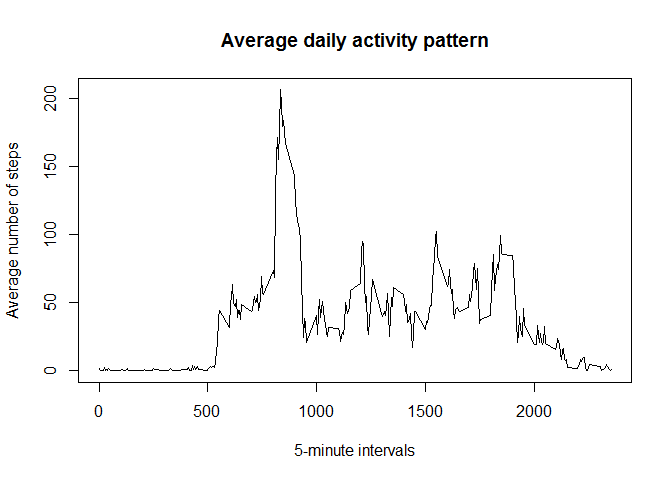
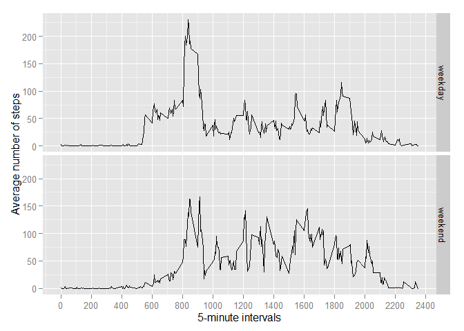

# Reproducible Research: Peer Assessment 1

This assignment makes use of data from a personal activity monitoring device. This device collects data at 5 minute intervals through out the day. The data consists of two months of data from an anonymous individual collected during the months of October and November, 2012 and include the number of steps taken in 5 minute intervals each day.

The data for this assignment can be downloaded from the course web
site: [Activity monitoring data](https://d396qusza40orc.cloudfront.net/repdata%2Fdata%2Factivity.zip) [52K]. But since the GitHub repository already contains the dataset for the assignment the code to download the data separately is not provided here. The code works as long as the dataset is located in the current working directory.

## Loading and preprocessing the data

First, the script unzips a file if necessary and reads it into a variable called `activity`. The second column of the dataset is transformed into a Date class object for further needs.


```r
## unzip if necessary
if(!file.exists("activity.csv")) {
    unzip(zipfile = "activity.zip")
}

## read data, transform dates
activity <- read.csv("activity.csv", stringsAsFactors = FALSE)
activity$date <- as.Date(activity$date)
```

Here is a sample of the dataset:


```r
head(activity)
```

```
##   steps       date interval
## 1    NA 2012-10-01        0
## 2    NA 2012-10-01        5
## 3    NA 2012-10-01       10
## 4    NA 2012-10-01       15
## 5    NA 2012-10-01       20
## 6    NA 2012-10-01       25
```

## What is mean total number of steps taken per day?
## summarise by dates, calculate total number of steps taken each day

Next, the data is summarised by dates into a new dataset `by_dates` using **dplyr** package, and the total number of steps taken each day is calculated and added to this dataset as a variable `totalsteps`. **Mean** and **median** of total number of steps taken per day are also calculated and added as `mean` and `median` variables respectively. Missing values are ignored.


```r
require(dplyr)
by_dates <- summarise(group_by(activity, date), 
                   totalsteps = sum(steps), 
                   mean = mean(steps, na.rm = TRUE), 
                   median = median(steps, na.rm = TRUE))
```

Below is a histogram of the total number of steps taken each day.


```r
hist(by_dates$totalsteps, breaks = 20, 
     main = "Total number of steps taken each day",
     xlab = "Number of steps")
```

 

The values of `mean` and `median` are as follows:


```r
by_dates$mean
```

```
##  [1]        NaN  0.4375000 39.4166667 42.0694444 46.1597222 53.5416667
##  [7] 38.2465278        NaN 44.4826389 34.3750000 35.7777778 60.3541667
## [13] 43.1458333 52.4236111 35.2048611 52.3750000 46.7083333 34.9166667
## [19] 41.0729167 36.0937500 30.6284722 46.7361111 30.9652778 29.0104167
## [25]  8.6527778 23.5347222 35.1354167 39.7847222 17.4236111 34.0937500
## [31] 53.5208333        NaN 36.8055556 36.7048611        NaN 36.2465278
## [37] 28.9375000 44.7326389 11.1770833        NaN        NaN 43.7777778
## [43] 37.3784722 25.4722222        NaN  0.1423611 18.8923611 49.7881944
## [49] 52.4652778 30.6979167 15.5277778 44.3993056 70.9270833 73.5902778
## [55] 50.2708333 41.0902778 38.7569444 47.3819444 35.3576389 24.4687500
## [61]        NaN
```

```r
by_dates$median
```

```
##  [1] NA  0  0  0  0  0  0 NA  0  0  0  0  0  0  0  0  0  0  0  0  0  0  0
## [24]  0  0  0  0  0  0  0  0 NA  0  0 NA  0  0  0  0 NA NA  0  0  0 NA  0
## [47]  0  0  0  0  0  0  0  0  0  0  0  0  0  0 NA
```

The results demonstrate that there are 8 days with no data recorded at all.

## What is the average daily activity pattern?

In order to get the average daily activity pattern, the dataset is summarised by 5-minute intervals. Below is a time series plot of the 5-minute interval (x-axis) and the average number of steps taken, averaged across all days (y-axis).


```r
by_intervals <- summarise(group_by(activity, interval),
                          mean = mean(steps, na.rm = TRUE))

plot(by_intervals$interval, by_intervals$mean, type = "l",
     main = "Average daily activity pattern",
     xlab = "5-minute intervals", 
     ylab = "Average number of steps")
```

 

The following code calculates the 5-minute interval, on average across all the days in the dataset, which contains the maximum number of steps.


```r
maxnum <- by_intervals[which.max(by_intervals$mean), ]
print(maxnum)
```

```
## Source: local data frame [1 x 2]
## 
##   interval     mean
## 1      835 206.1698
```

The maximum value 206.1698113 corresponds to the interval 835.

## Imputing missing values

Since the presence of missing days may introduce bias into some data manipulation, it may be necessary to fill in some values instead of NAs. First, let's calculate the total number of missing values in the dataset.


```r
removeNA <- complete.cases(activity)
sum(!removeNA)
```

```
## [1] 2304
```

2304 missing values correspond to 8 days with missing data (288 intervals per day). To fill in these values we use the mean for that 5-minute interval. The new dataset without NAs is called `newdata`.


```r
newdata <- activity
for (i in 1:nrow(newdata)) {
    if (is.na(newdata[i, "steps"])) {
        newdata[i, "steps"] <- 
            by_intervals[which(by_intervals$interval == newdata[i, "interval"],
                               arr.ind = TRUE), "mean"]
        newdata[i, "steps"] <- round(newdata[i, "steps"], digits = 0)
    }
}
```

Then `newdata` with filled in values is summarised by dates into a new dataset `new_by_dates` using **dplyr** package, and the total number of steps taken each day is calculated and added to this dataset as a variable `totalsteps`. **Mean** and **median** of total number of steps taken per day are also calculated and added as `mean` and `median` variables respectively.


```r
new_by_dates <- summarise(group_by(newdata, date), 
                       totalsteps = sum(steps), 
                       mean = mean(steps, na.rm = TRUE), 
                       median = median(steps, na.rm = TRUE))
```

Below is a histogram of the total number of steps taken each day (with some data filled in instead of NA).


```r
hist(new_by_dates$totalsteps, breaks = 20, 
     main = "Total number of steps taken each day (without NAs)",
     xlab = "Number of steps")
```

 

The new values of `mean` and `median` are as follows:


```r
new_by_dates$mean
```

```
##  [1] 37.3680556  0.4375000 39.4166667 42.0694444 46.1597222 53.5416667
##  [7] 38.2465278 37.3680556 44.4826389 34.3750000 35.7777778 60.3541667
## [13] 43.1458333 52.4236111 35.2048611 52.3750000 46.7083333 34.9166667
## [19] 41.0729167 36.0937500 30.6284722 46.7361111 30.9652778 29.0104167
## [25]  8.6527778 23.5347222 35.1354167 39.7847222 17.4236111 34.0937500
## [31] 53.5208333 37.3680556 36.8055556 36.7048611 37.3680556 36.2465278
## [37] 28.9375000 44.7326389 11.1770833 37.3680556 37.3680556 43.7777778
## [43] 37.3784722 25.4722222 37.3680556  0.1423611 18.8923611 49.7881944
## [49] 52.4652778 30.6979167 15.5277778 44.3993056 70.9270833 73.5902778
## [55] 50.2708333 41.0902778 38.7569444 47.3819444 35.3576389 24.4687500
## [61] 37.3680556
```

```r
new_by_dates$median
```

```
##  [1] 34.5  0.0  0.0  0.0  0.0  0.0  0.0 34.5  0.0  0.0  0.0  0.0  0.0  0.0
## [15]  0.0  0.0  0.0  0.0  0.0  0.0  0.0  0.0  0.0  0.0  0.0  0.0  0.0  0.0
## [29]  0.0  0.0  0.0 34.5  0.0  0.0 34.5  0.0  0.0  0.0  0.0 34.5 34.5  0.0
## [43]  0.0  0.0 34.5  0.0  0.0  0.0  0.0  0.0  0.0  0.0  0.0  0.0  0.0  0.0
## [57]  0.0  0.0  0.0  0.0 34.5
```

Thereby imputing missing values affected the original data significantly. While `mean` values seem to be realistic, `median` is likely to be predicted  mistakenly. Values of total number of steps taken each day were also slightly affected demonstrating a shift towards average values.

## Are there differences in activity patterns between weekdays and weekends?

First, `weekday` factor variable is added to the `newdata` dataset. The script checks the day of a week of the corresponding Date object and assignes one of the two labels ("weekday" and "weekend") indicating whether a given date is a weekday or weekend day. Since the output of the `weekdays()` is locale dependent, usage of this function together with character representation of days of a week may require adjusting locale for the end user and in its turn may result in problems with reproducibility. Therefore a more universal approach was chosen to code weekdays as decimal numbers 1 to 7 using `strftime(..., format = "%u")` where 1 stands for Monday. Also for the sake of this assignment **weekend days are considered to be Saturday and Sunday**. If the research is going to take place in a country with another weekend policy the code should be adjusted as appropriate.


```r
newdata$weekday <- as.numeric(strftime(newdata$date, format = "%u"))

for (i in 1:5) {
    newdata$weekday <- gsub(i, "weekday", newdata$weekday)
}

for (i in 6:7) {
    newdata$weekday <- gsub(i, "weekend", newdata$weekday)
}

newdata$weekday <- as.factor(newdata$weekday)
```

Below is a panel plot containing a time series plot of the 5-minute interval (x-axis) and the average number of steps taken, averaged across all weekday days or weekend days (y-axis). **ggplot2** package is required for this plot.


```r
require(ggplot2)
new_by_intervals <- summarise(group_by(newdata, interval, weekday), 
                                   mean = mean(steps))

tsplot <- ggplot(new_by_intervals, aes(interval, mean))
tsplot + geom_line() + facet_grid(weekday ~ .) + 
    scale_x_continuous(breaks = pretty(new_by_intervals$interval, n = 12)) + 
    labs(x = "5-minute intervals", y = "Average number of steps")
```

 

According to the plot, weekdays demonstrate a longer activity period starting at around 5.30 am while on weekends it starts slightly later and is shifted towards the end of a day. Also the weekday pattern includes an evident peak in the morning with lower activity later in the day. The weekend pattern is more even across the day.

